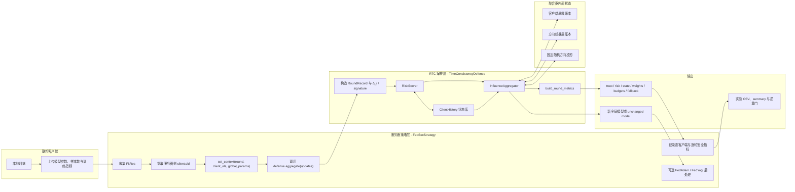
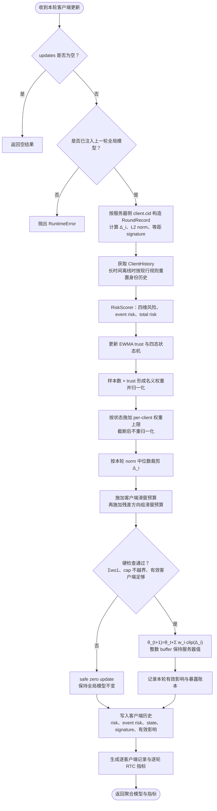
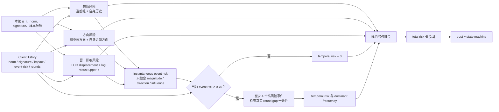
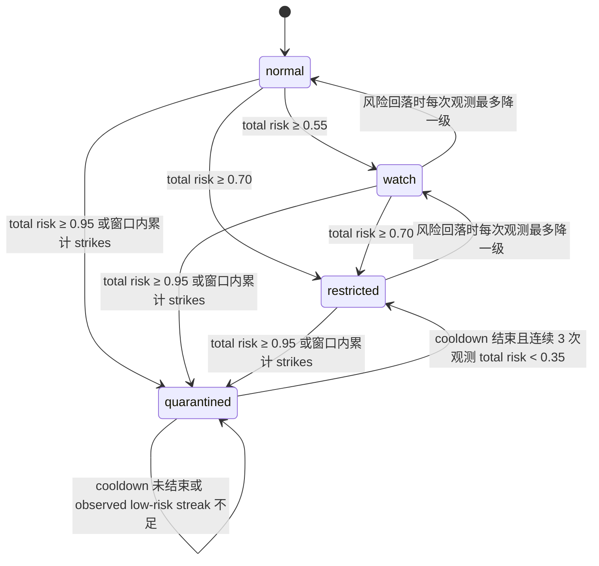
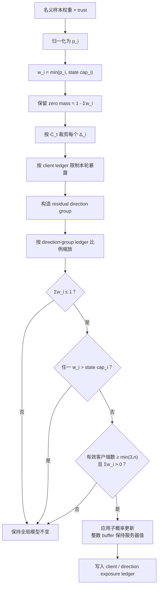
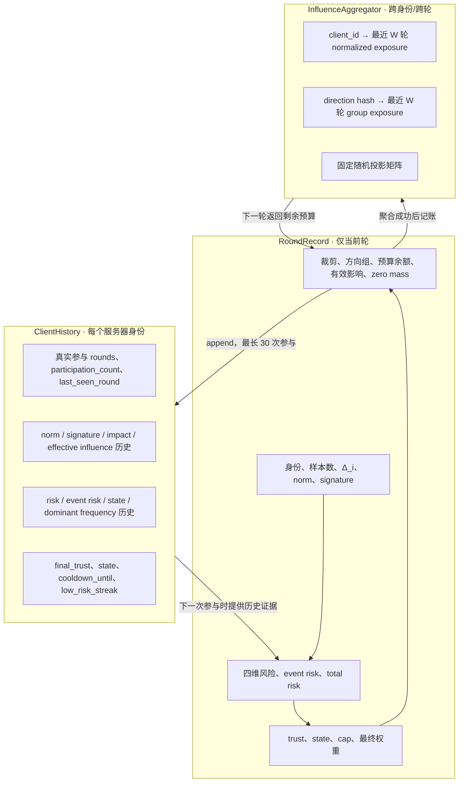

# RTC 现行方案、流程图与结构图

> 整理日期：2026-07-23  
> 口径：以当前工作区源码为准。这里的 RTC 指联邦学习中的 **Round-aware Time-Consistency defense（RTC-v2）**，不是音视频 Real-Time Communication。  
> 配置入口仍使用 `security.defense.type=time_consistency`；`rtc_full` 是实验层对该实现的一组预设。

## 1. 结论先行

现行 RTC 是一个运行在联邦学习服务器聚合阶段的有状态防御器。它不直接判断“某客户端一定恶意”，而是完成四件事：

1. 将每个客户端上传模型转换为相对上一轮全局模型的更新 `Δ_i`，并按服务器侧稳定身份保存跨轮历史。
2. 从幅值、方向、时间周期和留一影响四个维度计算风险，再更新 EWMA trust 与四态状态机。
3. 对样本量/信任权重施加状态上限、范数裁剪、客户端滑窗暴露预算和残差方向组滑窗预算。
4. 使用严格子概率权重聚合：最终权重和允许小于 1，缺失质量对应 zero update，绝不通过重新归一化放大剩余客户端；约束失效或有效客户端不足时保持全局模型不变。

现行实现已经落地“留一影响、严格子概率聚合、客户端/方向组暴露账本和安全零更新回退”，但还不是设计文档中完整的 PA-WRDEC：它没有独立 `AnchorEstimator`、全局 residual ledger、soft cone、独立攻击/恢复证据或约束优化求解器。

## 2. 系统位置与模块结构

### 2.1 结构图



### 2.2 模块职责

| 模块 | 现行职责 | 关键输入 | 关键输出/状态 |
|---|---|---|---|
| [`strategies/fed_strategy.py`](strategies/fed_strategy.py#L182) | 服务器轮次入口；使用 `client.cid` 建立可信身份键；传入上一轮全局模型；汇总防御指标 | `FitRes[]`、`server_round`、当前全局参数 | 聚合模型、round/client metrics |
| [`defenses/defense_base.py`](defenses/defense_base.py#L40) | 防御接口与上下文协议；按 `time_consistency` 延迟加载 RTC | round、client IDs、global params | `TimeConsistencyDefense` 实例 |
| [`defenses/time_consistency_defense.py`](defenses/time_consistency_defense.py#L28) | RTC 总编排；构造记录、调用评分/状态/聚合、写回历史和指标 | 客户端模型与样本数 | 全局参数、`_last_records`、信任/权重映射 |
| [`defenses/rtc/history.py`](defenses/rtc/history.py#L11) | 定义跨轮 `ClientHistory` 与本轮 `RoundRecord` | 风险、更新签名、round、状态 | 最长 30 次参与历史与本轮完整决策记录 |
| [`defenses/rtc/scoring.py`](defenses/rtc/scoring.py#L13) | 四维风险、峰值增强融合、EWMA trust、四态状态机 | 当前组更新、客户端历史 | risks、event risk、total risk、trust、state |
| [`defenses/rtc/aggregation.py`](defenses/rtc/aggregation.py#L14) | 权重上限、裁剪、滑窗暴露约束、子概率聚合、安全回退 | records、updates、global params | 最终权重、暴露账本、新模型/零更新 |
| [`defenses/rtc/metrics.py`](defenses/rtc/metrics.py#L12) | 生成可观测性与硬约束诊断指标 | records、聚合器诊断 | trust/risk/state/budget/zero-mass/fallback metrics |
| [`experiments/periodic_attack.py`](experiments/periodic_attack.py#L68) | 定义 `rtc_full`、消融与目标验收门 | 实验条件、RTC 参数 | 运行矩阵、汇总、质量门 |

## 3. 单轮主流程



对应主调用链：

```text
FedSecStrategy.aggregate_fit
  └─ defense.set_context(server_round, server-side client IDs, global_params)
     └─ TimeConsistencyDefense.aggregate
        ├─ _build_records
        ├─ RiskScorer.score_records
        ├─ RiskScorer.update_state_and_trust
        ├─ InfluenceAggregator.assign_weights
        ├─ InfluenceAggregator.aggregate
        ├─ ClientHistory.append
        └─ build_round_metrics
```

## 4. 风险评分方案

### 4.1 输入表征

对客户端 `i`：

```text
Δ_i = client_params_i - global_params_t
norm_i = ||Δ_i||₂
signature_i = 从扁平浮点 Δ_i 中等距抽取最多 2048 个坐标
a_i = num_examples_i / Σ_j num_examples_j
```

只对浮点参数计算差分与签名；非浮点模型 buffer 不参与风险计算。

### 4.2 四维风险

| 风险 | 现行计算 | 主要作用 |
|---|---|---|
| `magnitude_risk` | 当前客户端 norm 相对本轮 norm 组、以及历史足够时相对自身 norm 历史的双侧 robust z-risk，取两者最大值 | 捕捉异常大/小更新 |
| `direction_risk` | signature 相对本轮中位 signature 的 cosine distance；有历史时再与最近最多 5 个自身 signature 的均值各占 50% | 捕捉群体离群方向和自身方向突变 |
| `influence_risk` | 先算精确的样本权重留一位移，再在 log 空间做当前组/自身历史的单侧 robust z-risk | 捕捉试图显著改变名义 FedAvg 的更新 |
| `temporal_risk` | 仅当当前 `event_risk ≥ 0.70` 时，检查最近至少 4 个高风险事件的真实 server-round 间隔；间隔 MAD 小于 1 才产生周期放大 | 捕捉重复 on-off 高风险事件；不会单独触发 |

留一影响尝试量为：

```text
nominal_delta = Σ_j a_j Δ_j
influence_attempt_i
  = a_i / (1 - a_i) · ||Δ_i - nominal_delta||₂
  = ||nominal_delta - nominal_delta_without_i||₂
```

### 4.3 融合流程图



默认融合权重为：

```text
r_weighted = 0.30·r_magnitude + 0.25·r_direction
           + 0.30·r_temporal  + 0.15·r_influence

r_total = 0.25·r_weighted + 0.75·max(r_magnitude,
                                    r_direction,
                                    r_temporal,
                                    r_influence)
```

其中 `peak_risk_weight=0.75`，所以任一强单项证据不会被平均值明显稀释。

## 5. Trust 与状态机

### 5.1 Trust 更新

```text
observation_trust = 1 - total_risk
trust_t = clip(0.75·trust_(t-1) + 0.25·observation_trust, 0.05, 1.0)
```

Trust 用于软权重；状态用于硬 cap。二者都由 `total_risk` 驱动，但作用位置不同。

### 5.2 状态转移图



“窗口内累计 strikes”指最近 4 次风险（含当前）中至少 2 次 `total_risk ≥ 0.80`。隔离 cooldown 默认为 2 个 server rounds；客户端缺席不会增加 low-risk streak。需要注意，现行 `offline_reset_rounds=10` 仍会在离线间隔大于 10 轮时重置该身份的历史、trust 和状态。

### 5.3 状态对应的硬权重上限

若本轮参与客户端数为 `n`：

| 状态 | 默认 cap | 含义 |
|---|---:|---|
| `normal` | `2.0 / n` | 正常身份最多获得均匀份额的 2 倍 |
| `watch` | `1.0 / n` | 观察态最多获得均匀份额 |
| `restricted` | `0.1 / n` | 严格限权 |
| `quarantined` | `0` | 不进入模型更新 |

## 6. 硬约束聚合

### 6.1 权重、裁剪与 zero mass

名义权重先融合 trust：

```text
q_i = num_examples_i · trust_i
p_i = q_i / Σ_j q_j
w_i^(state) = min(p_i, cap(state_i))
```

裁剪半径默认是本轮更新 norm 的中位数：

```text
C_t = median_i ||Δ_i||₂
clipped_delta_i = Δ_i · min(1, C_t / (||Δ_i||₂ + ε))
```

状态截断后的缺失质量不再分给其他客户端：

```text
s_t = 1 - Σ_i w_i,  s_t ≥ 0
θ_(t+1) = θ_t + Σ_i w_i · clipped_delta_i + s_t · 0
```

这使最终 cap 在聚合时仍然成立，也避免隔离某客户端后被动放大其余客户端。

### 6.2 滑窗暴露预算

默认窗口 `W=4` 个真实 server rounds，令：

```text
reference_norm = C_t
norm_ratio_i = ||clipped_delta_i||₂ / reference_norm
normalized_exposure_i = w_i · norm_ratio_i
```

当前实现依次施加：

1. **客户端预算**：每个身份最近 4 个 server rounds 的暴露总量不超过 `4.0 / n`。
2. **残差方向组预算**：将裁剪后的 signature 减去本轮中位 signature，再用固定种子随机超平面映射为 8-bit 方向组；当前组预算为 `4.0 × |G_t| / n`，组内候选权重在余额不足时同比例缩放。
3. **consensus 例外**：残差为零的 `consensus` 组不消耗方向组预算，但仍受客户端预算、状态 cap 和裁剪约束。

方向组键不依赖 client ID，因此同方向更新即使来自不同身份，也会共享同一方向组账本；不过现行实现没有全局 residual budget，且方向组是 hard hash，不是跨原型的 soft membership。

### 6.3 聚合决策流程



安全回退原因包括：

- `weight_mass_exceeds_one`
- `weight_cap_violation`
- `insufficient_effective_clients`
- `zero_effective_weight`

## 7. 状态与数据流



两个历史域的生命周期不同：

- `ClientHistory` 最多保留 30 次客户端参与事件，并可能被 `offline_reset_rounds` 清空。
- 暴露账本按真实 server round 滑出最近 4 轮；身份状态重置不会追溯删除尚未滑出的方向组账本。

## 8. 现行有效默认参数

`config/config.yaml` 默认关闭防御；实验中的 `rtc_full` 将类型设为 `time_consistency` 并显式覆盖核心参数。未显式给出的参数由类默认值补齐。

| 参数组 | 参数 | 当前有效值 |
|---|---|---:|
| 表征/历史 | `projection_dim` | 2048 |
|  | `max_history` | 30 次参与 |
|  | `offline_reset_rounds` | 10 |
| robust risk | `robust_z_threshold` | 3.0 |
|  | `risk_weights` | magnitude 0.30 / direction 0.25 / temporal 0.30 / influence 0.15 |
|  | `peak_risk_weight` | 0.75 |
| temporal | `high_risk_threshold` | 0.70 |
|  | `min_periodic_events` | 4 |
|  | `periodic_gap_tolerance` | 1.0 |
| trust/state | `trust_beta` | 0.75 |
|  | `min_trust` | 0.05 |
|  | `watch_threshold` | 0.55 |
|  | `restricted_threshold` | 0.70 |
|  | `quarantine_threshold` | 0.80 |
|  | `immediate_quarantine_threshold` | 0.95 |
|  | `quarantine_window / strikes` | 4 / 2 |
|  | `recovery_threshold / observations` | 0.35 / 3 |
|  | `quarantine_cooldown_rounds` | 2 |
| aggregation | `enable_soft_trust_weighting` | true |
|  | `enable_delta_clipping` / `clip_multiplier` | true / 1.0 |
|  | `state_weight_cap_multipliers` | 2.0 / 1.0 / 0.1 / 0.0 |
|  | `min_effective_clients` | 3 |
| exposure | `enable_exposure_budgets` | true |
|  | `exposure_window` | 4 server rounds |
|  | `client_exposure_budget_multiplier` | 4.0 |
|  | `direction_exposure_budget_multiplier` | 4.0 |
|  | `direction_group_bits / seed` | 8 / 42 |

旧的 [`RTC_V2_TARGET_MODE_REPORT.md`](RTC_V2_TARGET_MODE_REPORT.md) 记录的是 2026-07-09 阶段的实验口径，其中“最终默认参数”早于当前硬约束重构；现行参数应以上表和源码为准。

## 9. 可观测性与实验口径

### 9.1 逐客户端输出

服务器策略会保存：

- `trust`、`state`
- 四维 risk、`event_risk`、`total_risk`
- raw/clipped delta norm
- effective/aggregation weight
- clipped/capped/quarantined flags
- post-clipping impact proxy
- 恶意标签与攻击是否激活（仅用于实验评估，不参与 RTC 决策）

### 9.2 逐轮关键指标

- 信任均值/最小值/最大值
- 各风险均值、留一影响尝试量、有效影响
- watch/restricted/quarantined/effective client 数
- clip norm、裁剪/限权/隔离客户端数
- `rtc_aggregation_weight_sum` 与 `rtc_zero_update_mass`
- `rtc_max_weight_cap_violation`
- `rtc_max_exposure_budget_violation`
- client/direction 最小预算余额
- fallback 是否触发及原因

实验层对现行目标的主要验收门是：

- 攻击期 `mean RTC/FedAvg active ASR-AUC ≤ 0.50`
- 攻击期 `mean RTC/clip-only active ASR-AUC ≤ 0.80`
- 每个配对 seed 的 RTC 优于 FedAvg
- benign quarantine rate `≤ 5%`
- clean final accuracy 相对 FedAvg 的每 seed 降幅 `≤ 3 pp`
- cap/budget violation 近似为 0，且聚合权重和 `≤ 1`

## 10. 已实现保证与边界

### 10.1 代码层已经实现

- 历史按服务器侧 `client.cid` 建键，客户端上报指标不能直接伪造或重置 RTC 身份。
- 最终聚合权重非负、权重和不超过 1，并且 cap 后不重新归一化。
- 缺失权重质量显式对应 zero update。
- 非浮点模型 buffer 始终保持服务器值，不参与浮点加权和舍入。
- 客户端和方向组按真实 server round 维护滑窗暴露账本。
- 约束异常、零质量或有效客户端不足时返回 unchanged model。
- 风险、状态、最终权重、zero mass、预算余额和约束违反量均可观测。

### 10.2 不能从现行实现推出

- 不能保证低范数但高功能敏感性的后门一定被识别。
- 不能把参数暴露上界直接等价为 ASR 或模型功能安全上界。
- 没有恶意多数条件下的正确鲁棒锚点保证；本轮中位 signature 也不是可信梯度。
- 没有全局 residual ledger；攻击者若把更新分散到多个方向 hash，方向组预算的覆盖可能减弱。
- 方向组采用 8-bit hard hash，没有 soft cone、跨原型 split/merge 或 overflow/global 计费。
- `offline_reset_rounds=10` 仍允许长时间离线后重置身份信誉。
- 攻击证据和恢复证据仍共用单个 total-risk/EWMA 体系，不是独立序贯证据。
- 当前暴露约束是顺序裁剪与组内同比例缩放，不是设计文档中的显式约束优化器。
- 若启用策略层 FedAdam/FedYogi，RTC 约束的是进入服务器优化器前的聚合 delta；服务器优化器对最终模型步长的再变换不在当前暴露账本内。
- 服务器必须能查看单客户端更新；与隐藏单更新的 secure aggregation 不直接兼容。

## 11. 阅读与修改入口

按理解顺序建议从以下入口阅读：

1. [`TimeConsistencyDefense.aggregate`](defenses/time_consistency_defense.py#L64)：完整单轮编排。
2. [`RiskScorer.score_records`](defenses/rtc/scoring.py#L32)：四维评分与留一影响。
3. [`RiskScorer.update_state_and_trust`](defenses/rtc/scoring.py#L85)：trust 与状态机。
4. [`InfluenceAggregator.assign_weights`](defenses/rtc/aggregation.py#L51)：子概率权重和状态 cap。
5. [`InfluenceAggregator.aggregate`](defenses/rtc/aggregation.py#L92)：裁剪、预算、硬检查和模型更新。
6. [`InfluenceAggregator._apply_exposure_budgets`](defenses/rtc/aggregation.py#L179)：客户端/方向组滑窗账本。
7. [`build_round_metrics`](defenses/rtc/metrics.py#L12)：可观测指标。
8. [`RTC_V2_BASE`](experiments/periodic_attack.py#L68)：`rtc_full` 实验预设。
9. [`tests/test_rtc_hard_constraints.py`](tests/test_rtc_hard_constraints.py)：留一影响、zero mass、cap 和预算不变量测试。
